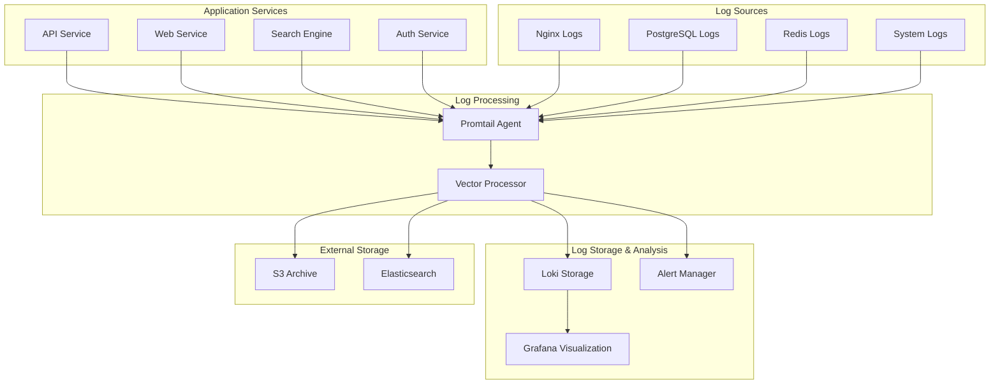

# CodeSenseiSearch Logging Architecture Guide

## Overview

This guide covers the complete logging infrastructure for CodeSenseiSearch, including log aggregation with Loki, log shipping with Promtail, advanced log processing with Vector, and comprehensive log analysis capabilities.

## Architecture

### Logging Stack Components



## Quick Start

### 1. Setup Logging Infrastructure

```bash
# Complete logging setup
./scripts/setup-logging.sh

# Or individual commands
./scripts/setup-logging.sh start    # Start services
./scripts/setup-logging.sh test     # Test setup
./scripts/setup-logging.sh stop     # Stop services
```

### 2. Access Logging Interfaces

- **Loki API**: http://localhost:3100
- **Vector API**: http://localhost:8686
- **Grafana (with Loki)**: http://localhost:3001
- **Log Analysis Dashboard**: Available in Grafana

### 3. Run Log Analysis

```bash
# Complete log analysis
./scripts/log-analysis.sh

# Specific analysis types
./scripts/log-analysis.sh errors      # Error pattern analysis
./scripts/log-analysis.sh security    # Security event analysis
./scripts/log-analysis.sh performance # Performance analysis
./scripts/log-analysis.sh search      # Search pattern analysis
```

## Structured Logging Implementation

### Using the Logger Library

```typescript
import { Logger, LogCategory, createApiLogger } from '@codesenseisearch/shared';

// Create service-specific logger
const logger = createApiLogger();

// Request logging (automatic with middleware)
app.use(requestLoggingMiddleware(logger));

// Error logging
try {
  // Your code here
} catch (error) {
  logger.logError(error, { context: 'user-registration' }, requestId, userId);
}

// Security logging
logger.logSecurity(
  'login',
  true,
  req.ip,
  req.get('User-Agent'),
  user.id,
  { method: 'oauth' }
);

// Search logging
logger.logSearch(
  query,
  results.length,
  responseTime,
  'semantic',
  userId,
  { filters: activeFilters }
);

// Performance logging
logger.logPerformance(
  'database-query',
  duration,
  true,
  { memory: process.memoryUsage().heapUsed },
  { query: 'user-search' }
);
```

### Log Entry Structure

All log entries follow a consistent structure:

```json
{
  "timestamp": "2024-11-08T10:30:45.123Z",
  "level": "info",
  "category": "search",
  "service": "codesenseisearch-api",
  "version": "1.0.0",
  "environment": "production",
  "message": "Search executed: \"react hooks\"",
  "query": "react hooks",
  "results_count": 42,
  "response_time": 185,
  "user_id": "usr_123456",
  "search_type": "semantic",
  "request_id": "req_789012",
  "hostname": "api-server-01"
}
```

## Log Categories and Examples

### 1. Application Logs

```typescript
// General application events
logger.info("User registration completed", LogCategory.APPLICATION, {
  user_id: user.id,
  email: user.email,
  registration_method: "email"
});

// Application errors
logger.logError(new Error("Database connection failed"), {
  operation: "user-lookup",
  retry_count: 3
});
```

### 2. Security Logs

```typescript
// Authentication events
logger.logSecurity("login", true, req.ip, req.get("User-Agent"), user.id);

// Authorization events
logger.logSecurity("access_denied", false, req.ip, req.get("User-Agent"), 
  user.id, { resource: "/admin/users", required_role: "admin" });

// Suspicious activity
logger.logSecurity("suspicious_activity", false, req.ip, req.get("User-Agent"), 
  null, { reason: "multiple_failed_attempts", count: 10 });
```

### 3. Performance Logs

```typescript
// API response times
logger.logPerformance("api-request", responseTime, true, {
  memory: process.memoryUsage().heapUsed,
  cpu: process.cpuUsage()
}, {
  endpoint: req.originalUrl,
  method: req.method
});

// Database operations
logger.logDatabase("user-query", queryTime, true, {
  query_type: "select",
  rows_returned: results.length
});
```

### 4. Business Logic Logs

```typescript
// Search operations
logger.logSearch(
  searchQuery,
  results.length,
  searchTime,
  "hybrid",
  userId,
  { 
    filters: request.filters,
    sort: request.sort,
    page: request.page 
  }
);

// User interactions
logger.logBusiness("content-view", LogLevel.INFO, {
  content_id: content.id,
  content_type: content.type,
  user_id: userId,
  view_duration: duration
});
```

## Log Processing Pipeline

### 1. Promtail Configuration

Promtail collects logs from various sources:

```yaml
scrape_configs:
  # Application logs
  - job_name: api-logs
    static_configs:
      - targets: [localhost]
        labels:
          job: api
          service: codesenseisearch-api
          __path__: /app/logs/api/*.log
    pipeline_stages:
      - json:
          expressions:
            timestamp: timestamp
            level: level
            message: message
            request_id: request_id
      - timestamp:
          source: timestamp
          format: RFC3339Nano
      - labels:
          level:
          request_id:
```

### 2. Vector Processing

Vector provides advanced log processing:

```toml
# Parse and enrich logs
[transforms.parse_json]
type = "remap"
inputs = ["app_logs"]
source = '''
if is_string(.message) {
  parsed = parse_json(.message) ?? {}
  . = merge(., parsed)
}
'''

# Add metadata
[transforms.add_metadata]
type = "remap"
inputs = ["parse_json"]
source = '''
.environment = "production"
.hostname = get_hostname() ?? "unknown"
.service = .container_name ?? "unknown"
'''

# Detect anomalies
[transforms.anomaly_detection]
type = "remap"
inputs = ["add_metadata"]
source = '''
if .level == "error" && contains(.message, "authentication") {
  .security_alert = true
}
if exists(.response_time) && to_float(.response_time) > 5000 {
  .performance_alert = true
}
'''
```

## Alerting Rules

### Log-Based Alerts in Loki

```yaml
groups:
  - name: application-errors
    rules:
      - alert: HighErrorRate
        expr: |
          (
            sum(rate({service=~"codesenseisearch-.*",level="error"}[5m])) by (service)
            /
            sum(rate({service=~"codesenseisearch-.*"}[5m])) by (service)
          ) > 0.05
        for: 5m
        labels:
          severity: warning
        annotations:
          summary: "High error rate detected in {{ $labels.service }}"

      - alert: SecurityThreat
        expr: |
          sum(rate({service=~"codesenseisearch-.*"} |= "authentication failed" [5m])) > 10
        for: 2m
        labels:
          severity: critical
        annotations:
          summary: "High number of authentication failures detected"
```

## Log Analysis and Monitoring

### 1. Grafana Dashboards

The Log Analysis dashboard provides:

- **Log Volume Trends**: Track log volume by service and level
- **Error Analysis**: Monitor error rates and patterns
- **Performance Insights**: Response time analysis from logs
- **Security Monitoring**: Authentication events and suspicious activity
- **Search Analytics**: Search success rates and popular queries

### 2. Automated Analysis

```bash
# Daily analysis (run via cron)
0 6 * * * /path/to/scripts/log-analysis.sh full

# Real-time anomaly detection
*/5 * * * * /path/to/scripts/log-analysis.sh anomalies

# Weekly performance report
0 9 * * 1 /path/to/scripts/log-analysis.sh performance
```

### 3. Custom Queries

```bash
# Search for specific error patterns
curl -G "http://localhost:3100/loki/api/v1/query_range" \
  --data-urlencode 'query={service="api"} |= "database" |= "error"' \
  --data-urlencode 'start=2024-11-08T00:00:00Z' \
  --data-urlencode 'end=2024-11-08T23:59:59Z'

# Performance analysis
curl -G "http://localhost:3100/loki/api/v1/query_range" \
  --data-urlencode 'query={service="api"} | json | response_time > 1000' \
  --data-urlencode 'start=2024-11-08T00:00:00Z'
```

## Performance Optimization

### 1. Log Retention

```yaml
# Loki configuration
limits_config:
  retention_deletes_enabled: true
  retention_period: 168h  # 7 days for detailed logs

table_manager:
  retention_deletes_enabled: true
  retention_period: 720h  # 30 days for aggregated data
```

### 2. Log Sampling

```typescript
// Sample high-volume logs
const shouldLog = () => {
  if (process.env.NODE_ENV === 'development') return true;
  if (logLevel === 'error') return true;
  return Math.random() < 0.1; // 10% sampling for info logs
};

if (shouldLog()) {
  logger.info("High volume event", category, metadata);
}
```

### 3. Efficient Querying

```yaml
# Use label filters for better performance
{service="api",level="error"}

# Avoid regex in high-cardinality labels
{service="api"} |= "error" |~ "database.*timeout"

# Use time ranges to limit query scope
{service="api"}[1h]
```

## Security Considerations

### 1. Sensitive Data Handling

```typescript
// Sanitize sensitive data before logging
const sanitizeLogData = (data: any) => {
  const sanitized = { ...data };
  delete sanitized.password;
  delete sanitized.token;
  delete sanitized.credit_card;
  
  // Mask email addresses
  if (sanitized.email) {
    sanitized.email = sanitized.email.replace(/(.{2}).*(@.*)/, '$1***$2');
  }
  
  return sanitized;
};

logger.info("User action", LogCategory.APPLICATION, sanitizeLogData(userData));
```

### 2. Access Control

```yaml
# Grafana role-based access
- Developers: Read access to application logs
- Security team: Full access to security logs
- Operations: Full access to infrastructure logs
- Auditors: Read-only access to all logs
```

### 3. Audit Logging

```typescript
// Audit trail for sensitive operations
logger.logSecurity("data_access", true, req.ip, req.get("User-Agent"), 
  userId, {
    resource: "user_data",
    action: "export",
    data_scope: "personal_information"
  });
```

## Troubleshooting

### Common Issues

1. **High Memory Usage in Loki**
   ```bash
   # Check Loki memory usage
   docker stats loki
   
   # Reduce retention period
   # Edit docker/loki/loki.yml
   retention_period: 72h  # Reduce from 168h
   ```

2. **Promtail Not Shipping Logs**
   ```bash
   # Check Promtail logs
   docker-compose logs promtail
   
   # Verify file permissions
   ls -la /app/logs/
   
   # Check Promtail positions
   cat docker/promtail/data/positions.yaml
   ```

3. **Vector Processing Errors**
   ```bash
   # Check Vector health
   curl http://localhost:8686/health
   
   # View Vector logs
   docker-compose logs vector
   
   # Validate Vector configuration
   docker exec vector vector validate /etc/vector/vector.toml
   ```

### Log Analysis Issues

```bash
# If log analysis fails, check Loki connectivity
curl http://localhost:3100/ready

# Verify log format
tail -f /app/logs/api/combined.log | jq .

# Check analysis dependencies
./scripts/log-analysis.sh help
```

## Integration with CI/CD

### Automated Log Validation

```yaml
# GitHub Actions workflow
- name: Validate Log Format
  run: |
    # Check that logs are valid JSON
    tail -100 logs/api/combined.log | while read line; do
      echo "$line" | jq . > /dev/null || exit 1
    done

- name: Log Analysis Report
  run: |
    ./scripts/log-analysis.sh report
    # Upload report to artifacts
```

### Log-Based Deployment Validation

```bash
# Check for errors after deployment
deployment_time=$(date -u +%Y-%m-%dT%H:%M:%SZ)
sleep 300  # Wait 5 minutes

error_count=$(curl -s -G "http://localhost:3100/loki/api/v1/query_range" \
  --data-urlencode 'query={level="error"}' \
  --data-urlencode "start=$deployment_time" | \
  jq '.data.result[].values | length')

if [ "$error_count" -gt 10 ]; then
  echo "High error count after deployment: $error_count"
  exit 1
fi
```

## Best Practices

### 1. Log Message Design

```typescript
// ✅ Good: Structured and searchable
logger.info("User registration completed", LogCategory.APPLICATION, {
  user_id: "usr_123",
  email: "user@example.com",
  duration_ms: 1250,
  verification_method: "email"
});

// ❌ Bad: Unstructured and hard to search
logger.info(`User user@example.com registered successfully in 1.25 seconds`);
```

### 2. Log Levels

- **ERROR**: System errors, exceptions, critical failures
- **WARN**: Recoverable errors, deprecated usage, performance issues
- **INFO**: Business events, user actions, system state changes
- **DEBUG**: Detailed execution flow, variable values (development only)

### 3. Performance Considerations

```typescript
// ✅ Good: Lazy evaluation
logger.debug("Complex calculation result", LogCategory.APPLICATION, () => ({
  result: expensiveCalculation(),
  metadata: generateMetadata()
}));

// ❌ Bad: Always executes expensive operations
logger.debug("Complex calculation result", LogCategory.APPLICATION, {
  result: expensiveCalculation(),  // Always runs even if debug is disabled
  metadata: generateMetadata()
});
```

## Maintenance

### Regular Tasks

1. **Daily**:
   - Monitor log volume and storage usage
   - Review error patterns and anomalies
   - Check alerting system health

2. **Weekly**:
   - Analyze log retention and cleanup
   - Review and optimize query performance
   - Update log parsing rules as needed

3. **Monthly**:
   - Audit log access and security
   - Review and optimize log retention policies
   - Performance testing of logging infrastructure

### Monitoring Checklist

- [ ] Loki storage usage < 80%
- [ ] Promtail shipping rate stable
- [ ] Vector processing latency < 1s
- [ ] No failed log ingestion
- [ ] Alert rules functioning correctly
- [ ] Log analysis reports generated successfully

---

**Last Updated**: November 2024  
**Version**: 1.0  
**Maintained by**: CodeSenseiSearch DevOps Team